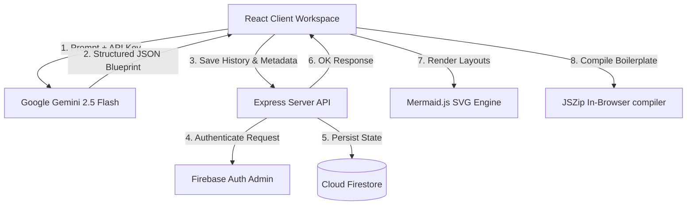

# 🧠 InfraMind — AI-Native System Architecture Workspace

[](https://react.dev)
[](https://expressjs.com)
[](https://firebase.google.com)
[](https://ai.google.dev)
[](https://vite.dev)

InfraMind is a production-grade system architecture prototyping platform that translates plain-text specifications into visual blueprints, database relational schemas, REST API contracts, and deployable codebase scaffolds in seconds.

---

## 🗺️ System Architecture & Data Flow



---

## ✨ Core Features

- **🎯 Contextual Diagram Renderer**: Interactive system architecture and sequence flowcharts rendered as native SVGs. Built with a dynamic `ResizeObserver` listener and subpixel-stable layout matching that automatically scales the diagram to match the height of your viewport.
- **🔍 Side-by-Side Node Inspector**: Click on any node in the topology diagram to inspect technical rationales, alternative choices, routing paths, or database keys on the side control panel.
- **🚀 In-Browser Scaffolder (JSZip)**: Instantly compile and download a zip folder containing complete project boilerplate scaffolds (e.g. `package.json`, routes, database models, environment files, and Docker compose files) compiled client-side.
- **🔒 Dynamic Share Channels (`/p/:shareId`)**: Generate public, read-only share links displaying the architecture tabs, diagram flows, and database schemas with a clean badges system showcasing the creator's profile links.
- **👤 Developer Profiles**: Custom settings supporting displayName, unique username validation, social portfolio links, and Base64-fallback image uploads to bypass Cloudinary endpoint outages.
- **⚡ Zustand Client Cache**: Uses cache-first state management to load saved projects instantly and prevent redundant Cloud Firestore read overhead.

---

## 🛠️ Stack Configuration

### Frontend Client
- **Core UI**: React 18 & Vite
- **Styling**: Vanilla CSS Modules (isolated modular component styles)
- **State Management**: Zustand & React Context
- **Integrations**: Mermaid.js, react-zoom-pan-pinch, html2canvas, jsPDF, and Posthog Analytics

### Backend Server
- **Runtime**: Node.js & Express
- **SDKs**: Firebase Admin SDK (token authentication, collection queries)
- **Database**: Cloud Firestore

---

## 📂 Project Directory Structure

```
inframind/
├── client/                     # React Frontend Module
│   ├── src/
│   │   ├── components/
│   │   │   ├── layout/         # UI Shell containers (Topbar, Sidebar, Inspector)
│   │   │   ├── ui/             # Core widgets (CommandPalette, Logo)
│   │   │   └── workspace/      # Dashboard, Auth, Modals, Share Controllers
│   │   ├── context/            # Auth Session Context Provider
│   │   ├── hooks/              # Custom React Hooks (useArchitecture, useAuth)
│   │   ├── store/              # Zustand Caches & Projects Store
│   │   ├── utils/              # PDF builders, ZIP compilers, API configs
│   │   └── index.css           # Global typography and design system tokens
│   ├── package.json
│   └── vite.config.js
├── server/                     # Express Node.js Backend API
│   ├── index.js                # Express entrypoint and API controllers
│   ├── service-account.json    # Firebase Admin SDK Credentials
│   └── package.json
├── firestore.rules              # Firestore DB Security Rules
└── USERFLOW.txt                 # Detailed site navigation flow specifications
```

---

## 🚀 Getting Started

### Prerequisites
Ensure you have the following installed locally:
- **Node.js** (v18 or higher)
- **npm** (v9 or higher)

### Setup & Installation
1. Clone the repository:
   ```bash
   git clone https://github.com/your-org/inframind.git
   cd inframind
   ```
2. Install dependencies for all modules:
   ```bash
   # Install root and module dependencies
   npm install
   cd client && npm install
   cd ../server && npm install
   ```

### Configurations

#### Client Configuration
Create a `.env` file in the `client/` directory:
```env
# API Configurations
REACT_APP_API_BASE_URL=http://localhost:5000/api

# Firebase Configuration
REACT_APP_FIREBASE_API_KEY=your_client_key
REACT_APP_FIREBASE_AUTH_DOMAIN=your_auth_domain
REACT_APP_FIREBASE_PROJECT_ID=your_project_id
REACT_APP_FIREBASE_STORAGE_BUCKET=your_storage_bucket
REACT_APP_FIREBASE_MESSAGING_SENDER_ID=your_sender_id
REACT_APP_FIREBASE_APP_ID=your_app_id

# Cloudinary Config (Avatar Uploads)
REACT_APP_CLOUDINARY_CLOUD_NAME=dydsp9cdj
REACT_APP_CLOUDINARY_UPLOAD_PRESET=inframind

# Optional PostHog Analytics
VITE_POSTHOG_KEY=your_posthog_key
```

#### Server Configuration
Create a `.env` file in the `server/` directory:
```env
PORT=5000

# Service account configuration path or JSON string
FIREBASE_SERVICE_ACCOUNT=service-account.json
```
Make sure your Firebase service account JSON key is placed inside the `server/` directory as `service-account.json`.

---

## 📡 API Interface Specifications

All endpoints require authorization via a Firebase ID token passed in the header: `Authorization: Bearer <id_token>`.

### Profile Endpoints

- **`GET /api/profile`**: Retrieve the user's profile details.
- **`POST /api/profile`**: Update or create a profile. Performs lowercase uniqueness check on usernames.
  - **Request Body**:
    ```json
    {
      "username": "janesmith",
      "name": "Jane Smith",
      "photoUrl": "https://res.cloudinary.com/...",
      "githubUrl": "https://github.com/...",
      "twitterUrl": "https://twitter.com/...",
      "linkedinUrl": "https://linkedin.com/..."
    }
    ```

### Projects & History Endpoints

- **`GET /api/projects`**: Get a list of the user's projects with names, summaries, metrics, and dates.
- **`GET /api/projects/:projectId/history`**: Get all snapshots/versions of a project's history.
- **`POST /api/projects/history`**: Save a prompt version. Creates the project if `projectId` is missing.

### Share Endpoints

- **`POST /api/projects/:projectId/share`**: Mark a project as public and create a root-level share document. Returns `{ shareId, shareUrl }`.
- **`DELETE /api/projects/:projectId/share`**: Revoke public sharing and delete the shared document.
- **`GET /api/public/:shareId`**: Public route (no auth token required). Resolves the shared system blueprint, metadata, and creator bio details.

---

## ⚡ Development Workflow

To spin up the local development environment:
```bash
# Run client and server concurrent development servers from the root
npm run dev
```

- **Client Server**: Launching on [http://localhost:5173](http://localhost:5173) (or dynamic port)
- **API Server**: Listening on [http://localhost:5000](http://localhost:5000)

---

## 📄 License
MIT © InfraMind Technologies
