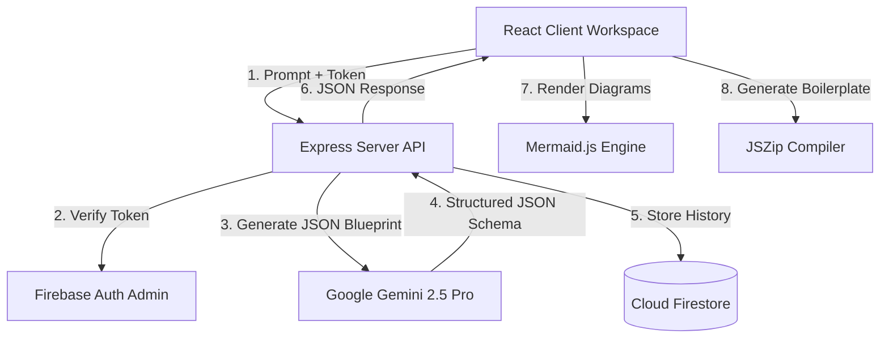

# InfraMind — AI-Native System Architecture Planner & Workspace

> Turn system design prompts into interactive diagrams, schema definitions, API contracts, and download-ready project scaffolds in seconds.

InfraMind is a production-grade system architecture prototyping platform built with a modern React + Express + Firebase + Gemini stack. Designed for developers and architects, it translates plain-text specifications into visual blueprints, database relational diagrams, staging env files, and ZIP project boilerplates.

---

## 🛠️ System Architecture & Data Flow



---

## 🚀 Core Developer Features

* **Deep-Linkable Navigation (React Router v6)**: Clean route structure (`/`, `/dashboard`, `/workspace/:projectId`) enabling direct bookmarking, immediate hydration, and back-button navigation for individual architecture workspaces.
* **Calm Design & Progressive Disclosure**: Minimizes visual clutter by default. Complex presets, custom stack tags, and secondary navigation are tucked away under the `⚙ Customize Stack & Presets` toggle, allowing developers to focus on conceptual design.
* **User Profile & Custom Avatars**: Custom user settings panel supporting name, unique username (enforced in the backend), avatar photo uploads (using **Cloudinary** with a client-side **Base64 local image file fallback**), and developer social links (GitHub, LinkedIn, Twitter/X).
* **Interactive Public Share View (`/p/:shareId`)**: Dynamic shared links displaying the exact same interactive tabs, flowcharts, API tables, and database schemas as the creator's view, run in read-only mode (hiding prompt inputs) and featuring a premium author card badge.
* **Invisible Contextual AI (Component Optimizer)**: Click on any architecture node (database, server, gateway) to open the side Inspector Panel, and use the inline AI input to submit localized refinements. The prompt is automatically appended as a targeted modifier: `${lastIdea} (Refinement: Optimize component [${selectedNode}]: ${refinementText})`.
* **Empathetic Connection Recovery**: Employs human-voiced microcopy when connection rate-limits or glitches occur. Provides clear troubleshooting paths (retrying, returning to the dashboard, or configuring a custom client-side API Key in Settings).
* **Cached State Management (Zustand)**: Client-side store cache-first protocols. Project data is saved client-side to minimize redundant Cloud Firestore read overhead.
* **Interactive SVG Topologies (Mermaid.js)**: Flowcharts and event sequences render as native, responsive SVG elements in closeable modals with scroll-to-zoom, drag-to-pan, and node click detail callbacks.
* **In-Browser Project Boilerplates (JSZip)**: Translates generated stack recommendations and REST API definitions into downloadable project ZIP scaffolds (`package.json`, `README.md`, routes, entry stubs) compiled client-side.
* **Aesthetic Branding Assets (SimpleIcons CDN)**: Selected technologies automatically resolve to brand-colored SVG icons dynamically loaded from the CDN.

---

## 📂 Project Directory Structure

```
inframind/
├── client/                     # React Frontend Module
│   ├── src/
│   │   ├── components/
│   │   │   ├── layout/         # Persistent frames (AppShell, Sidebar, Topbar, InspectorPanel)
│   │   │   ├── ui/             # Core widgets (CommandPalette, Logo)
│   │   │   └── workspace/      # Dynamic views (LandingPage, Dashboard, GenerationStream, SavedArchitecturesModal, ProfileModal, PublicShare)
│   │   ├── context/            # Global Auth Context providers
│   │   ├── hooks/              # Custom lifecycles (useArchitecture)
│   │   ├── store/              # Zustand state caches
│   │   └── utils/              # PDF builders, ZIP compilers, analytics
│   ├── package.json
│   └── vite.config.js
├── server/                     # Express Node.js Backend Module
│   ├── index.js                # Express API Entry & Controllers (auth, projects, share, profile)
│   ├── service-account.json    # Firebase Admin SDK credentials
│   └── package.json
└── USERFLOW.txt                # Complete site flow & technical specifications
```

---

## ⚡ Quick Start

### 1. Prerequisites
Ensure you have the following installed on your machine:
* [Node.js](https://nodejs.org/) (v18 or higher)
* [npm](https://www.npmjs.com/) (v9 or higher)

### 2. Clone and Install Dependencies
Install all packages in both the frontend client and the backend server:

```bash
git clone https://github.com/your-org/inframind.git
cd inframind

# Install Root and Modules
npm install
cd client && npm install
cd ../server && npm install
```

### 3. Environment Configurations

#### Client Environment Variables
Create `client/.env` and specify the Firebase, Cloudinary client configurations:

```ini
REACT_APP_API_BASE_URL=http://localhost:5000/api
REACT_APP_FIREBASE_API_KEY=your_client_key
REACT_APP_FIREBASE_AUTH_DOMAIN=your_auth_domain
REACT_APP_FIREBASE_PROJECT_ID=your_project_id
REACT_APP_FIREBASE_STORAGE_BUCKET=your_storage_bucket
REACT_APP_FIREBASE_MESSAGING_SENDER_ID=your_sender_id
REACT_APP_FIREBASE_APP_ID=your_app_id
VITE_POSTHOG_KEY=your_optional_analytics_key

# Cloudinary Credentials (Frontend upload preset)
REACT_APP_CLOUDINARY_CLOUD_NAME=dydsp9cdj
REACT_APP_CLOUDINARY_UPLOAD_PRESET=inframind
```

#### Server Environment Variables
Create `server/.env` and specify your Gemini developer key and Firebase Admin credentials:

```ini
GEMINI_API_KEY=your_google_ai_studio_api_key
PORT=5000
```
Make sure your Firebase Service Account JSON credentials file is located in `server/service-account.json`.

### 4. Running the Development Stack
Run the client dev server and server API together from the project root:

```bash
# In Root Directory
npm run dev
```
* Frontend client launches on [http://localhost:5174](http://localhost:5174)
* Backend API listens on [http://localhost:5000](http://localhost:5000)

---

## 📡 API Contract Specification

### 1. Profile Endpoints

#### `GET /api/profile`
Fetches current user's profile details. Requires authorization token.
* **Response `200 OK`**:
```json
{
  "profile": {
    "username": "janesmith",
    "name": "Jane Smith",
    "photoUrl": "https://res.cloudinary.com/...",
    "githubUrl": "https://github.com/...",
    "twitterUrl": "https://twitter.com/...",
    "linkedinUrl": "https://linkedin.com/..."
  }
}
```

#### `POST /api/profile`
Updates or creates the user's profile document. Performs backend **lowercase uniqueness validation** on the username fields across the database. Requires authorization token.
* **Request Body**:
```json
{
  "username": "janesmith",
  "name": "Jane Smith",
  "photoUrl": "https://res.cloudinary.com/...",
  "githubUrl": "https://github.com/...",
  "twitterUrl": "https://twitter.com/...",
  "linkedinUrl": "https://linkedin.com/..."
}
```
* **Response `200 OK`**:
```json
{
  "success": true,
  "profile": { ... }
}
```
* **Response `400 Bad Request`** (e.g., if username is already taken):
```json
{
  "error": "Username is already taken"
}
```

---

## 💾 Firestore Schema Definitions

### Users Document (`users/{uid}`)
```json
{
  "profile": {
    "username": "string (lowercase, unique)",
    "name": "string",
    "photoUrl": "string (Cloudinary URL or Base64)",
    "githubUrl": "string",
    "twitterUrl": "string",
    "linkedinUrl": "string"
  }
}
```

### Shares Document (`shares/{shareId}`)
```json
{
  "shareId": "string",
  "ownerId": "string (uid references users/{uid})",
  "projectId": "string",
  "title": "string",
  "summary": "string",
  "architecture": "object (Gemini JSON Schema)",
  "createdAt": "timestamp"
}
```

---

## 📄 License
MIT © InfraMind Technologies
