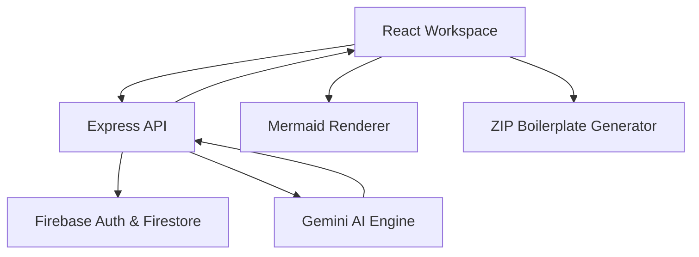

# InfraMind  
### AI-Native System Architecture Planner & Developer Workspace

> Transform raw product ideas into production-ready system blueprints, architecture flows, database schemas, API contracts, and starter project scaffolds — all in seconds.

InfraMind is an AI-powered architecture intelligence platform built for modern developers, startups, and engineering teams. It converts plain-text product ideas into interactive technical workspaces with visual system design, infrastructure planning, backend contracts, and downloadable starter boilerplates.

Designed with a modern React + Express + Firebase + Gemini stack, InfraMind bridges the gap between ideation and implementation.

---

# ✨ Why InfraMind?

Building software usually starts with scattered notes, unclear architecture decisions, and repeated setup work.

InfraMind eliminates that friction by acting like an AI Systems Architect that can:

- Understand high-level product requirements
- Recommend scalable tech stacks
- Generate architecture diagrams
- Create API contracts and schema definitions
- Produce starter project scaffolds
- Store and share interactive workspaces

---

# 🚀 Core Features

## 🧠 AI-Powered Architecture Planning
Convert natural language prompts into structured engineering blueprints powered by Gemini models.

## 🗺️ Interactive System Design
Render architecture flows, event pipelines, and infrastructure topologies using dynamic SVG-based Mermaid visualizations.

## 🧩 Smart Workspace System
Each project gets its own persistent workspace with:
- Architecture overview
- Database design
- API contracts
- Deployment planning
- Stack recommendations
- Generated boilerplates

## ⚡ Instant Project Scaffolding
Generate downloadable starter templates including:
- Backend routes
- API structure
- Environment templates
- README files
- Package configurations

## 🔐 Secure Authentication & Profiles
Powered by Firebase Authentication and Firestore with:
- Custom usernames
- Avatar uploads
- Social developer profiles
- Shareable public architecture pages

## 🌐 Public Share Links
Publish read-only architecture workspaces using unique share URLs for teams, clients, or portfolio showcases.

## 🧠 Contextual AI Refinement
Select any infrastructure component and refine it using localized AI prompts directly from the Inspector Panel.

## 💾 Optimized Client State Management
Uses Zustand cache-first state management to reduce unnecessary backend reads and improve responsiveness.

---

# 🏗️ Platform Architecture



---

# 🧰 Tech Stack

| Layer | Technologies |
|---|---|
| Frontend | React, Vite, Zustand, React Router |
| Backend | Node.js, Express |
| AI Engine | Gemini 2.5 Pro |
| Database | Cloud Firestore |
| Authentication | Firebase Auth |
| Media Storage | Cloudinary |
| Diagram Engine | Mermaid.js |
| Packaging | JSZip |

---

# 📁 Project Structure

```txt
inframind/
├── client/
│   ├── components/
│   ├── hooks/
│   ├── store/
│   ├── utils/
│   └── pages/
│
├── server/
│   ├── routes/
│   ├── controllers/
│   ├── services/
│   └── middleware/
│
└── docs/
```

---

# ⚙️ Environment Setup

## Client

```env
VITE_API_BASE_URL=
VITE_FIREBASE_API_KEY=
VITE_FIREBASE_AUTH_DOMAIN=
VITE_FIREBASE_PROJECT_ID=
VITE_CLOUDINARY_CLOUD_NAME=
VITE_CLOUDINARY_UPLOAD_PRESET=
```

## Server

```env
GEMINI_API_KEY=
PORT=5000
```

---

# 🚀 Quick Start

## Clone Repository

```bash
git clone https://github.com/your-org/inframind.git
cd inframind
```

## Install Dependencies

```bash
npm install
cd client && npm install
cd ../server && npm install
```

## Start Development Environment

```bash
npm run dev
```

### Development Servers

- Frontend → `http://localhost:5174`
- Backend → `http://localhost:5000`

---

# 📡 Core APIs

## Profile Management

- `GET /api/profile`
- `POST /api/profile`

## Project Workspaces

- Create architecture sessions
- Save generated system plans
- Load previous workspaces
- Share public architecture views

## AI Generation

- Generate architecture blueprints
- Refine infrastructure nodes
- Create API definitions
- Produce deployment suggestions

---

# 🗄️ Database Design

## Users Collection
Stores:
- Profile details
- Usernames
- Avatars
- Social links

## Projects Collection
Stores:
- AI-generated architecture JSON
- System diagrams
- Stack metadata
- Workspace history

## Shares Collection
Stores:
- Public architecture snapshots
- Share IDs
- Author metadata

---

# 🎯 Product Vision

InfraMind is designed to become the operating system for early-stage software architecture.

Instead of spending hours planning infrastructure manually, developers can:
- Prototype systems faster
- Validate architecture decisions
- Share technical blueprints instantly
- Bootstrap projects with production-ready foundations

---

# 🔮 Planned Features

- Multi-agent architecture reasoning
- Kubernetes deployment generation
- Terraform infrastructure export
- AI DevOps recommendations
- Team collaboration workspaces
- Real-time architecture editing
- AI-generated sequence diagrams
- Plugin marketplace

---

# 📄 License

MIT License © InfraMind Technologies
