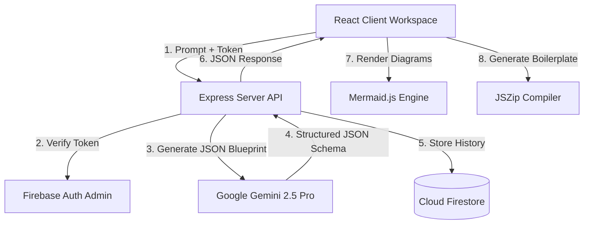

# InfraMind — AI-Native System Architecture Planner & Workspace

> Turn system design prompts into interactive diagrams, schema definitions, API contracts, and download-ready project scaffolds in seconds.

InfraMind is a production-ready system architecture prototyping platform built with a modern React + Express + Firebase + Gemini stack. Designed for developers and architects, it translates plain-text specifications into visual blueprints, database relational diagrams, staging env files, and ZIP project boilerplates.

---

## 🛠️ System Architecture & Data Flow



---

## 🚀 Core Developer Features

* **Deep-Linkable Navigation (React Router v6)**: Routes are structured cleanly (`/`, `/dashboard`, `/workspace/:projectId`). Direct bookmarks load and synchronize project state dynamically on page mount.
* **Cached State Management (Zustand)**: Uses Zustand store cache-first protocols. Project data is saved client-side to minimize redundant Cloud Firestore read overhead.
* **Interactive SVG Topologies (Mermaid.js)**: Flowcharts and event sequences render as native, responsive SVG elements in closeable modals with scroll-to-zoom, drag-to-pan, and node click detail callbacks.
* **In-Browser Project Boilerplates (JSZip)**: Translates generated stack recommendations and REST API definitions into downloadable project ZIP scaffolds (`package.json`, `README.md`, routes, entry stubs) compiled client-side.
* **Aesthetic Branding Assets (SimpleIcons CDN)**: Selected technologies automatically resolve to brand-colored SVG icons dynamically loaded from the CDN.
* **Global Error Boundaries**: Traps render-time crash failures gracefully and displays branded recovery options.
* **Pulser Health Indicator**: An operational green pulsing status dot linked to system status updates.

---

## 📂 Project Directory Structure

```
inframind/
├── client/                     # React Frontend Module
│   ├── src/
│   │   ├── components/
│   │   │   ├── layout/         # Persistent frames (AppShell, Sidebar, Topbar, InspectorPanel)
│   │   │   ├── ui/             # Core widgets (CommandPalette, Logo)
│   │   │   └── workspace/      # Dynamic views (LandingPage, Dashboard, GenerationStream, SavedArchitecturesModal)
│   │   ├── context/            # Global Auth Context providers
│   │   ├── hooks/              # Custom lifecycles (useArchitecture)
│   │   ├── store/              # Zustand state caches
│   │   └── utils/              # PDF builders, ZIP compilers, analytics
│   ├── package.json
│   └── vite.config.js
├── server/                     # Express Node.js Backend Module
│   ├── routes/                 # Endpoint controller layers (generate, projects, share)
│   ├── service-account.json    # Firebase Admin SDK credentials
│   ├── index.js                # Server entry point
│   └── package.json
└── USERFLOW.txt                # Complete site flow & technical specifications
```

---

## ⚡ Quick Start

### 1. Prerequisites
Ensure you have the following installed on your machine:
* [Node.js](https://nodejs.org/) (v18 or higher)
* [npm](https://www.npmjs.com/) (v9 or higher)

### 2. Clone and Install Dependencies
Install all packages in both the frontend client and the backend server:

```bash
git clone https://github.com/your-org/inframind.git
cd inframind

# Install Root and Modules
npm install
cd client && npm install
cd ../server && npm install
```

### 3. Environment Configurations

#### Client Environment Variables
Create `client/.env` and specify the Firebase client configuration:

```ini
REACT_APP_API_BASE_URL=http://localhost:5000/api
REACT_APP_FIREBASE_API_KEY=your_client_key
REACT_APP_FIREBASE_AUTH_DOMAIN=your_auth_domain
REACT_APP_FIREBASE_PROJECT_ID=your_project_id
REACT_APP_FIREBASE_STORAGE_BUCKET=your_storage_bucket
REACT_APP_FIREBASE_MESSAGING_SENDER_ID=your_sender_id
REACT_APP_FIREBASE_APP_ID=your_app_id
VITE_POSTHOG_KEY=your_optional_analytics_key
```

#### Server Environment Variables
Create `server/.env` and specify your Gemini developer key and Firebase Admin credentials:

```ini
GEMINI_API_KEY=your_google_ai_studio_api_key
PORT=5000
```
Make sure your Firebase Service Account JSON credentials file is located in `server/service-account.json`.

### 4. Running the Development Stack
Run the client dev server and server API together from the project root:

```bash
# In Root Directory
npm run dev
```
* Frontend client launches on [http://localhost:5174](http://localhost:5174)
* Backend API listens on [http://localhost:5000](http://localhost:5000)

---

## 📡 API Contract Specification

When calling `POST /api/projects/history`, the API returns a structured architecture JSON blueprint matching this strict Typescript schema interface:

```typescript
interface GeminiArchitectureBlueprint {
  projectTitle: string;
  projectSummary: string;
  architectureExplanation: {
    whyThisStack: string;
    keyDecisions: string[];
  };
  stack: Array<{
    layer: string;
    recommendation: string;
  }>;
  mermaidDiagram: string;       // Mermaid flowchart layout markup
  userFlowDiagram: string;      // Mermaid sequence event markup
  apis: Array<{
    method: 'GET' | 'POST' | 'PUT' | 'PATCH' | 'DELETE';
    route: string;
    description: string;
  }>;
  dbSchema: Array<{
    collection: string;
    fields: Array<{
      name: string;
      type: string;
      note: string;
    }>;
  }>;
  deploymentStrategy: {
    Development: string;
    Staging: string;
    Production: string;
  };
  scalability: Array<{
    area: string;
    detail: string;
  }>;
  mvpRoadmap: Array<{
    phase: string;
    duration: string;
    tasks: string[];
  }>;
}
```

---

## 📄 License
MIT © InfraMind Technologies
